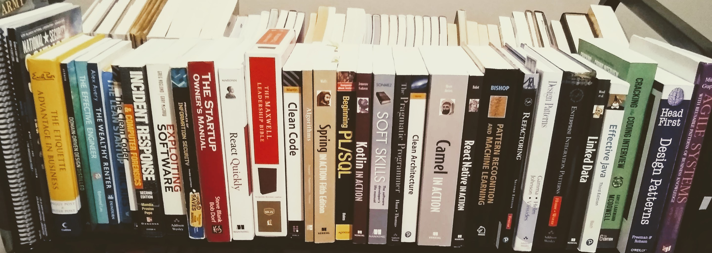

How do I know my shit?

I read BOOKS. A lot. From people who know their shit. Yes, I learn a ton working and from personal experience. But books
allow you to learn from OTHER people's experiences, often decades more experience.  It's awesome when you can find a good mentor, 
but when you read BOOKS you can acquire yourself some of the best
mentors in the industry for a nominal price by reading there most comprehensive thoughts.

Below are some of my book recommendations:

[Clean Code](https://www.amazon.com/gp/product/0132350882/ref=as_li_tl?ie=UTF8&camp=1789&creative=9325&creativeASIN=0132350882&linkCode=as2&tag=skiptheviking-20&linkId=6649d19eb218bc766ae4b5cb570efe61)
 by Robert C. Martin

Do you want to write clean code? You cannot go wrong with this book. Robert C. Martin 
aka Uncle Bob has one of my favorite writing styles.  And he has 50 years (50 YEARS!!!!) of writing code
experience, so you cannot go wrong with his advice.  It is tried and true.

[The Effective Engineer](https://www.amazon.com/gp/product/0132350882/ref=as_li_tl?ie=UTF8&camp=1789&creative=9325&creativeASIN=0132350882&linkCode=as2&tag=skiptheviking-20&linkId=6649d19eb218bc766ae4b5cb570efe61) by Edmond Lau

START with this book if you want to be an effective engineer.  This is a red pill / blue pill scenario.  If you want to know
how things are done right, read this book.  Or stay in the matrix and
keep with the status quo.

[The Systems Bible](https://amzn.to/37MwiFT)
by John Gall

A MUST read.  Before you build software you must understand SYSTEMS. What do I mean by systems?
Everything is a system.  And all systems have inherent properties.  Every system wants to expand
to fill the known universe.  Only simple systems work.  Complex systems that work only work because
they are composed of simpler systems.  These principles and much more are found in this book
in often humorous (but true) examples.  You won't be able to put this one down.

[Clean Architecture](https://amzn.to/2urvesI)
by Robert C. Martin

You want clean architecture? Invert your dependencies towards least change. How do I know this? This book!
Another hit from Uncle Bob - this is a must read if you want to design a system that is flexible and maintanable.

[The Maxwell Leadership Bible](https://amzn.to/37S86SS)

Yes, I'm getting religious on you. This is the NKJV version of the bible with commentary
from John C. Maxwell, one of the best writers on leadership.  I have yet to read one thing
from his commentary that hasn't helped me in the workplace be a better leader.  Remember, leadership
and management are different things.  Not everyone is a manager, but everyone ought to [be a leader](/first-raid).
 
 
